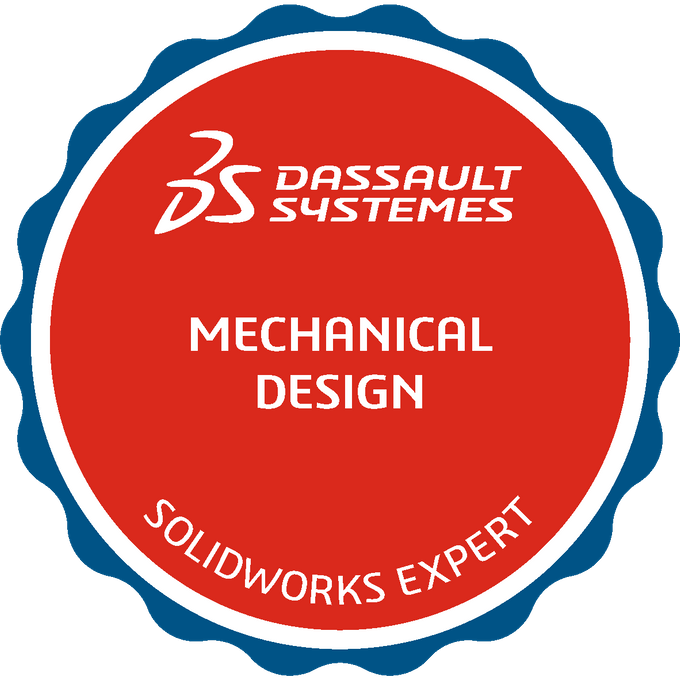

#

###  Solidworks Expert (CSWE)

 
by Dassault Systems – 2022

------------------------

### Solidworks Advanced Professional (CSWPA)

   
by Dassault Systems – 2022

------------------------

### Solidworks Professional in Mechanical Design (CSWP)

by Dassault Systems – 2019

------------------------

### Solidworks Associate (CSWA)

 
by Dassault Systems – 2019

by Dassault Systems - 2022
------------------------